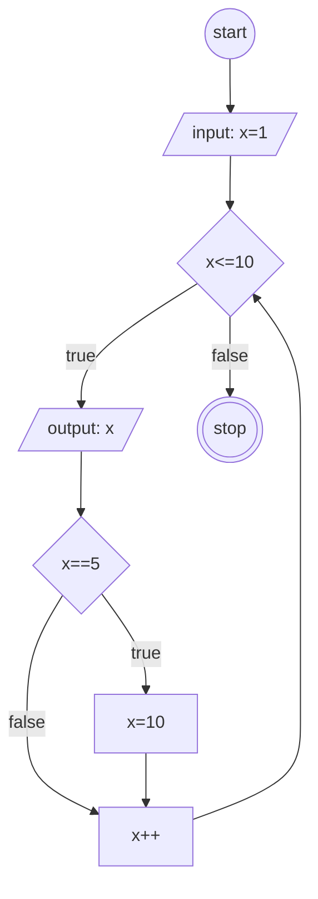
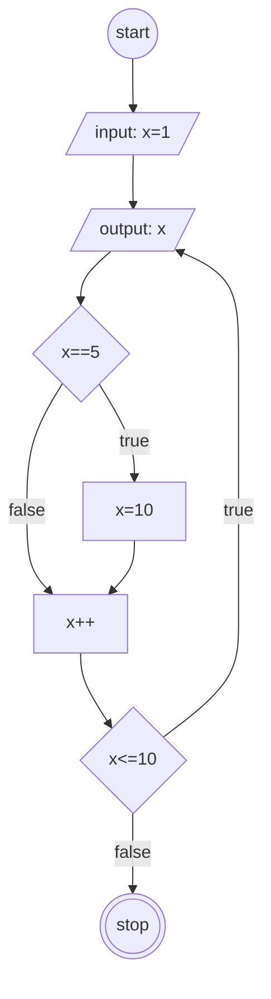

# For loop

```mermaid
flowchart TD
start@{shape: circ}
init@{shape: lean-r, label: "input: x=1"}
for@{shape: diamond, label: "x<=10"}
cons@{shape: lean-r, label: "output: x"}
if@{shape: diamond, label: "x==5"}
ifTrue@{shape: rect, label: "x=10"}
update@{shape: rect, label: "x++"}
forStop@{shape: dbl-circ, label: "stop"}


start-->init-->for-->|true| cons-->if
if-->|true| ifTrue 
if-->|false| update
for-->|false| forStop

ifTrue-->update-->for
```
## Do While Loop

```mermaid
flowchart TD
start@{shape: circ}
init@{shape: lean-r, label: "input: x=1"}
for@{shape: diamond, label: "x<=10"}
cons@{shape: lean-r, label: "output: x"}
if@{shape: diamond, label: "x==5"}
ifTrue@{shape: rect, label: "x=10"}
update@{shape: rect, label: "x++"}
forStop@{shape: dbl-circ, label: "stop"}

start-->init
init-->cons
cons-->if
if-->|true| ifTrue
if-->|false| update-->for
ifTrue-->update
for-->|false| forStop
for-->|true| cons
```