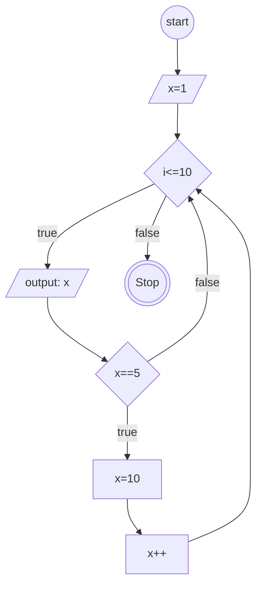

# 

```mermaid
flowchart TD
start@{shape: circ}
init@{shape: lean-r, label: "x=1"}
for@{shape: diamond, label: "i<=10"}
cons@{shape: lean-r, label: "output: x"}
if@{shape: diamond, label: "x==5"}
ifTrue@{shape: rect, label: "x=10"}
update@{shape: rect, label: "x++"}
forStop@{shape: dbl-circ, label: "Stop"}


start-->init-->for-->|true| cons-->if
if-->|true| ifTrue 
if-->|false| for
for-->|false| forStop

ifTrue-->update-->for
```