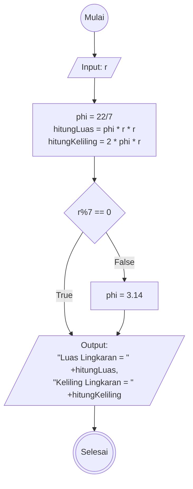

```mermaid
flowchart TD
    mulai@{ shape: circ, label: "Mulai"}
    input@{ shape: lean-r, label: "Input: r"}
    defRumus@{ shape: rect, label: "phi = 22/7
    hitungLuas = phi * r * r
    hitungKeliling = 2 * phi * r"}
    
    if@{shape: diamond, label: "r%7 == 0"}
    inP3@{ shape: rect, label: "phi = 3.14"}
    
    selesai@{ shape: dbl-circ, label: "Selesai"}

    output@{ shape: lean-r, label: "Output:
    #quot;Luas Lingkaran = #quot; +hitungLuas,
    #quot;Keliling Lingkaran = #quot; +hitungKeliling"}

    
mulai-->input-->defRumus-->if
if-->|True| output-->selesai
if-->|False| inP3-->output
```