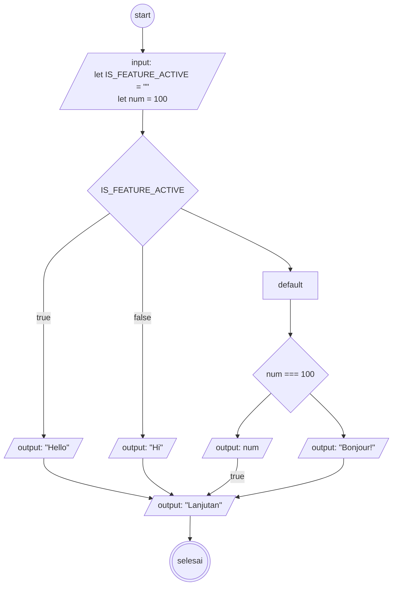

```mermaid
flowchart TD

start@{shape: circ}
init@{shape: lean-r, label: "input: 
let IS_FEATURE_ACTIVE = #quot;#quot;
let num = 100"}

switch@{shape: diamond, label: "IS_FEATURE_ACTIVE"}
caseT@{shape: lean-r, label: "output: #quot;Hello#quot;"}
caseF@{shape: lean-r, label: "output: #quot;Hi#quot;"}
default@{}
if@{shape: diamond, label: "num === 100"}
ifT@{shape: lean-r, label: "output: num"}
else@{shape: lean-r, label: "output: #quot;Bonjour!#quot;"}
lanjutan@{shape: lean-r, label: "output: #quot;Lanjutan#quot;"}
selesai@{shape: dbl-circ}

start-->init-->switch
switch-->|true| caseT
switch-->|false| caseF
switch-->default
default-->if
if-->ifT
if-->else
caseT-->lanjutan
caseF-->lanjutan
ifT-->|true| lanjutan
else-->lanjutan
lanjutan-->selesai
```