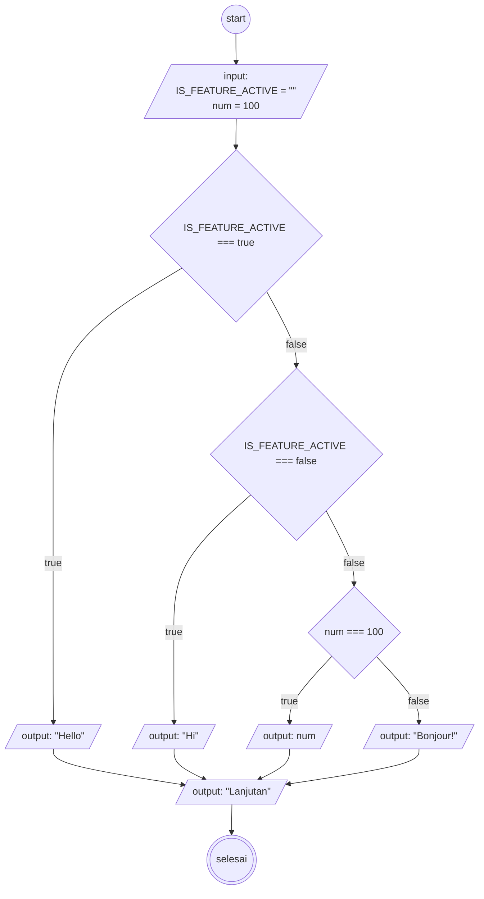

```mermaid
flowchart TD

start@{shape: circ}
init@{shape: lean-r, label: "input: 
IS_FEATURE_ACTIVE = #quot;#quot;
num = 100"}

swT@{shape: diamond, label: "IS_FEATURE_ACTIVE === true"}
swF@{shape: diamond, label: "IS_FEATURE_ACTIVE === false"}
caseT@{shape: lean-r, label: "output: #quot;Hello#quot;"}
caseF@{shape: lean-r, label: "output: #quot;Hi#quot;"}

if@{shape: diamond, label: "num === 100"}
ifT@{shape: lean-r, label: "output: num"}
else@{shape: lean-r, label: "output: #quot;Bonjour!#quot;"}
lanjutan@{shape: lean-r, label: "output: #quot;Lanjutan#quot;"}
selesai@{shape: dbl-circ}

start-->init
init-->swT-->|true| caseT
swT-->|false| swF
swF-->|true| caseF
swF-->|false| if
if-->|true| ifT
if-->|false| else
caseT-->lanjutan
caseF-->lanjutan
ifT--> lanjutan
else-->lanjutan
lanjutan-->selesai
```