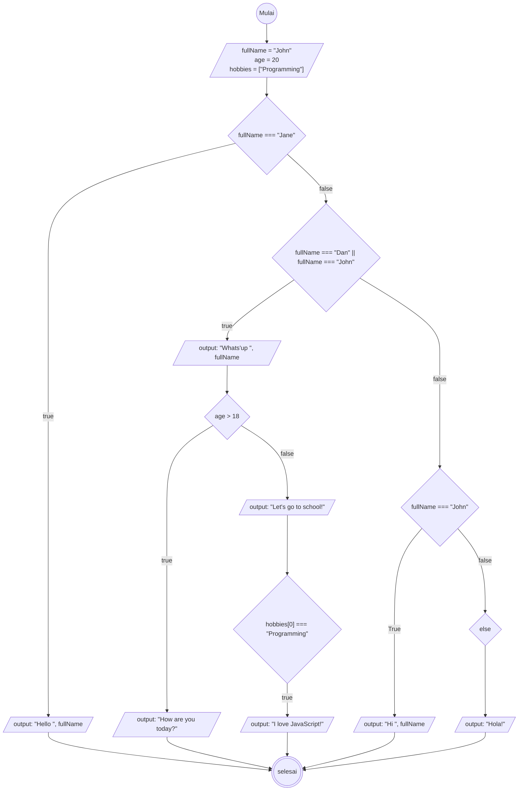

```mermaid
flowchart TD
    mulai@{ shape: circ, label: "Mulai"}
    selesai@{shape: dbl-circ}
    def@{shape: lean-r, label: "fullName = #quot;John#quot;
    age = 20
    hobbies = [#quot;Programming#quot;]"}

    ifJane@{shape: diamond, label: "fullName === #quot;Jane#quot;"}
    benarJane@{shape: lean-r, label: "output: #quot;Hello #quot;, fullName"}

    ifDanJohn@{shape: diamond, label: "fullName === #quot;Dan#quot; || fullName === #quot;John#quot;"}
    outDanJohn@{shape: lean-r, label: "output: #quot;Whats'up #quot;, fullName"}

    ifJohn@{shape: diamond, label: "fullName === #quot;John#quot;"}
    benarJohn@{shape: lean-r, label: "output: #quot;Hi #quot;, fullName"}

    else@{shape: diamond}
    hola@{shape: lean-r, label: "output: #quot;Hola!#quot;"}

    if18@{shape: diamond, label: "age > 18"}
    benar18@{shape: lean-r, label: "output: #quot;How are you today?#quot;"}
    salah18@{shape: lean-r, label: "output: #quot;Let's go to school!#quot;"}

    ifHobi@{shape: diamond, label: "hobbies[0] === #quot;Programming#quot;"}
    benarHobi@{shape: lean-r, label: "output: #quot;I love JavaScript!#quot;"}


    

mulai-->def-->ifJane
ifJane-->|true| benarJane-->selesai
ifJane-->|false| ifDanJohn
ifDanJohn-->|true| outDanJohn-->if18
if18-->|true| benar18-->selesai
if18-->|false| salah18
salah18-->ifHobi
ifHobi-->|true| benarHobi-->selesai

ifDanJohn-->|false| ifJohn
ifJohn-->|True| benarJohn-->selesai
ifJohn-->|false| else-->hola-->selesai
```
