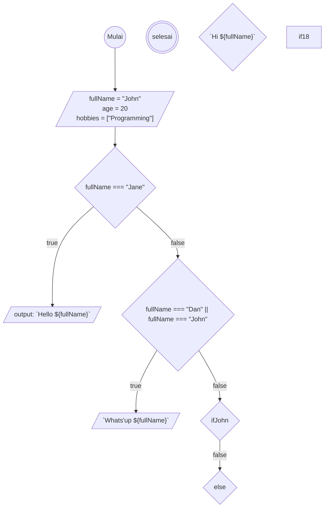

```mermaid
flowchart TD
    mulai@{ shape: circ, label: "Mulai"}
    selesai@{shape: dbl-circ}
    def@{shape: lean-r, label: "fullName = #quot;John#quot;
    age = 20
    hobbies = [#quot;Programming#quot;]"}

    ifJane@{shape: diamond, label: "fullName === #quot;Jane#quot;"}
    benarJane@{shape: lean-r, label: "output: `Hello ${fullName}`"}

    ifDanJohn@{shape: diamond, label: "fullName === #quot;Dan#quot; || fullName === #quot;John#quot;"}
    outDanJohn@{shape: lean-r, label: "`Whats'up ${fullName}`"}

    ifJohn@{shape: diamond}
    benarJohn@{shape: diamond, label: "`Hi ${fullName}`"}

    else@{shape: diamond}

    if18@{shape diamond}

    

mulai-->def-->ifJane
ifJane-->|true| benarJane
ifJane-->|false| ifDanJohn
ifDanJohn-->|true| outDanJohn
ifDanJohn-->|false| ifJohn
ifJohn
ifJohn-->|false| else
```
