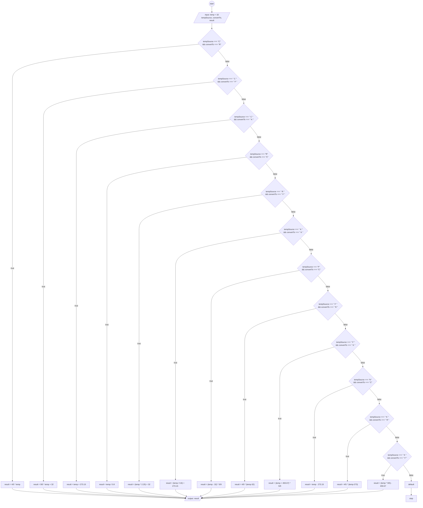

# Flowchart Task 4

```mermaid
flowchart TD

start@{shape: circ}
input@{shape: lean-r, label: "input: temp = 32
tempSource, convertTo, result"}

cr@{shape: diamond, label: "tempSource === #quot;C#quot;
&& convertTo === #quot;R#quot;"}
CtoR@{shape: rect, label: "result = 4/5 * temp"}
cf@{shape: diamond, label: "tempSource === #quot; C #quot;
&& convertTo === #quot; F #quot;"}
CtoF@{shape: rect, label: "result = 9/5 * temp + 32"}
ck@{shape: diamond, label: "tempSource === #quot; C #quot;
&& convertTo === #quot; K #quot;"}
CtoK@{shape: rect, label: "result = temp + 273.15"}

rc@{shape: diamond, label: "tempSource === #quot;R#quot;
&& convertTo === #quot;C#quot;"}
RtoC@{shape: rect, label: "result = temp / 0.8"}
rf@{shape: diamond, label: "tempSource === #quot; R #quot;
&& convertTo === #quot; F #quot;"}
RtoF@{shape: rect, label: "result = (temp * 2.25) + 32"}
rk@{shape: diamond, label: "tempSource === #quot; K #quot;
&& convertTo === #quot; K #quot;"}
RtoK@{shape: rect, label: "result = (temp / 0.8) + 273.15 "}

fc@{shape: diamond, label: "tempSource === #quot;F#quot;
&& convertTo === #quot;C#quot;"}
FtoC@{shape: rect, label: "result = (temp - 32) * 5/9"}
fr@{shape: diamond, label: "tempSource === #quot; F #quot;
&& convertTo === #quot; R #quot;"}
FtoR@{shape: rect, label: "result = 4/9 * (temp-32)"}
fk@{shape: diamond, label: "tempSource === #quot; F #quot;
&& convertTo === #quot; K #quot;"}
FtoK@{shape: rect, label: "result = (temp + 459.67) * 5/9"}


kc@{shape: diamond, label: "tempSource === #quot;K#quot;
&& convertTo === #quot;C#quot;"}
KtoC@{shape: rect, label: "result = temp - 273.15"}
kr@{shape: diamond, label: "tempSource === #quot; K #quot;
&& convertTo === #quot; R #quot;"}
KtoR@{shape: rect, label: "result = 4/5 * (temp-273)"}
kf@{shape: diamond, label: "tempSource === #quot; K #quot;
&& convertTo === #quot; F #quot;"}
KtoF@{shape: rect, label: "result = (temp * 9/5) - 459.67"}

console@{shape: lean-r, label: "output: result"}

start-->input-->cr
cr-->|true| CtoR-->console
cr-->|false| cf

cf-->|true| CtoF-->console
cf-->|false| ck

ck-->|true| CtoK-->console
ck-->|false| rc

rc-->|true| RtoC-->console
rc-->|false| rf

rf-->|true| RtoF-->console
rf-->|false| rk

rk-->|true| RtoK-->console
rk-->|false| fc

fc-->|true| FtoC-->console
fc-->|false| fr

fr-->|true| FtoR-->console
fr-->|false| fk

fk-->|true| FtoK-->console
fk-->|false| kc

kc-->|true| KtoC-->console
kc-->|false| kr

kr-->|true| KtoR-->console
kr-->|false| kf

kf-->|true| KtoF-->console
kf-->|false| default

default-->stop
```